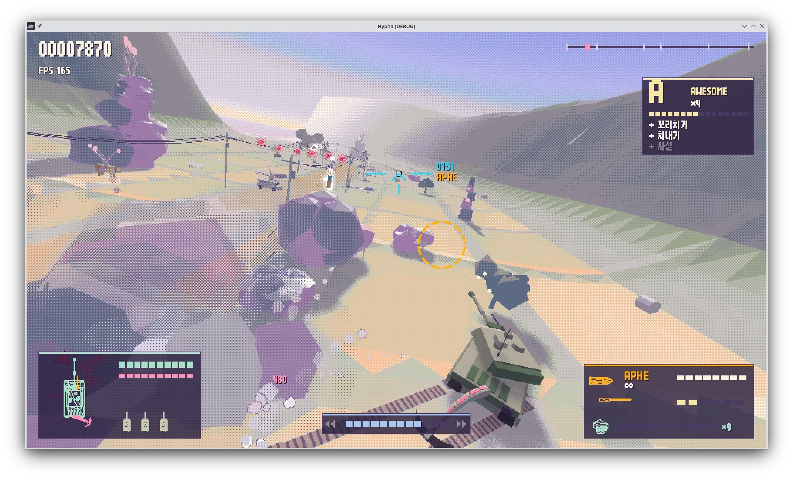

# Orca Class



1. Yet another tank shooter
2. Yes, this is entirely vibe coded in opus 5.5

## Play

Needs Godot 4.7.2+ (stable)

```sh
godot --path .
godot --path . -- --play # skip title screen
```

### Web

```sh
mkdir -p builds/web
touch builds/.gdignore
godot --headless --path . --export-release Web builds/web/index.html
python3 tools/serve_web.py
```

Open [the local game](http://127.0.0.1:8000) in a desktop browser with WebGL 2 and WebAssembly.

## Develop

### Run Test

```sh
godot --headless --path . --import   # refresh the class cache after adding class_name scripts
godot --headless --fixed-fps 60 --path . -- --run=res://tests/run.gd [--only=tail]
```

The exit code is the number of failed checks.

```sh
godot --path . -- --debug-room
```

Tools run through the main scene with `--run`:

```sh
# Bot playthrough with screenshots and frame timing. A small window keeps xvfb's software presentation cheap.
xvfb-run -a godot --path . --resolution 960x540 -- --run=res://tools/autoplay.gd \
  --seconds=420 --scale=3 --god --shots=30,60 --out=builds/auto [--checkpoint=boss] [--profile]
# Screenshots of every debug room row.
xvfb-run -a godot --path . --resolution 960x540 -- --run=res://tools/debug_room_shots.gd --out=builds/debug_room
# Course fly-through screenshots.
xvfb-run -a godot --path . -- --run=res://tools/capture_course.gd --d=100,700,1620 --out=builds/shots
```

Generated content:

- `python3 tools/strings.py` writes `i18n/strings.csv` (Korean and English).
- `uv run --with numpy tools/audio.py` synthesizes the effects in `assets/audio/synth/` and the music in
  `assets/music/`.

### Layout

- `scripts/core`: palette, flat-shaded mesh builder, dither view, settings and audio autoloads.
- `scripts/world`: course geography, terrain streaming, scenery, stage script and director, rail and camera.
- `scripts/player`: the tank, its model, weapons data and tail.
- `scripts/enemies`: FPV drones, UGVs, UAVs, attack helicopters, crawlers, spitters, the colossus mid-boss and the
  twin-rotor gunship boss.
- `scripts/combat`: hits, entities, projectiles, pickups, hazards and effects.
- `scripts/ui`: HUD, menus, title, results.

## Credits

- Tank concept and specifications: [`scarf005/orca-class`](https://github.com/scarf005/orca-class).
- Recorded sound effects: CC0; see [`assets/audio/ATTRIBUTION.md`](assets/audio/ATTRIBUTION.md).
- Font: x10y12pxDenkiChipHangul, SIL OFL 1.1; see [`assets/fonts/ATTRIBUTION.md`](assets/fonts/ATTRIBUTION.md).
- Synthesized effects, music, models and code were made for this project.
